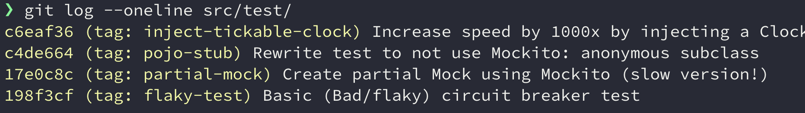

# Trusted tests

This folder contains supporting code that relates to [my presentation at Posten in December 2024](https://docs.google.com/presentation/d/e/2PACX-1vS8frdMD3PNr5yg1l2WNBJRpmQOoHFfan2bzbmrSOEX_mMsIO8Orlk7DeVozYlJDO3Lfe7bD-MqOh3e/pub?start=true&loop=false&delayms=10000) on creating tests that are fast, reliable and have a high return on investment. I also show some techniques for both the JVM world and the JS world on how you usually control time. Some links in that presentation link to Posten internal repositories, but most links are to public repos, such as this and [Anders Sveen's beautiful example demo on using Fakes](https://github.com/anderssv/the-example).

**I make extensive use of Git to show before-and-after code, so 90% of the story is viewing the commit history to see how the tests evolve!**

## Techniques covered in the Java examples

### Using Adapters to test Circuit Breakers
The original test was flaky (non-deterministic). Employing the [Adapter pattern](https://refactoring.guru/design-patterns/adapter) and creating a wrapper around the code protected by the circuit breaker enables us to inject small and meaningful test-doubles to exercise the various paths of the circuit breaker, removing the source of unstability.

### Partial mocking using Mockito
Shows use of Mockto's `@Spy` annotation (same as `mockito.spy()`) to partially mock a class to instrument a Mock in returning values that will trigger the circuit breaker

### Replacing use of a Mockito with a POJO
Turns out a simple anonymous class might do the job just fine. Faster execution and might be suitable where you do not need many permuations of the mock.

### Removing uses `Thread.sleep` in favor of a injectable clock
This is a powerful technique to show and control time-dependant tests

### Ensuring architectural rules using ArchUnit
If you need to ensure no rogue uses of forbidden methods arise that will
compromise your pure One Clock To Rule Them All architecture, this is it.

### Using Awaitility to await some condition when you cannot touch the code
Some times you might not be allowed to touch the code and refactor for
whatever reason. Then some slow E2E test might be the only option. For that
Awaitility is your friend.

## Techniques covered in the JS examples

### Replacing the system clock 
Formatting utils can have consistent tests when you know what time it is

### Controlling timers in async/Promise code
Enables you to check the status at any given time in a process while
ensuring that the tests pass in milliseconds, rather than seconds

