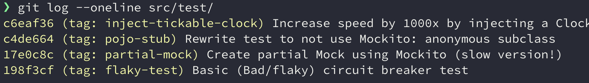

# Trusted tests

This folder contains supporting code that relates to my presentation on how to creating tests that are fast, reliable and have a high return on investment. I also show some techniques for both the JVM and JS-worlds on how you usually control time.

**I make extensive use of Git to show before-and-after code, so 90% of the story is viewing the commit history to see how the tests evolve!**

## Techniques covered in the Java examples

### Using Adapters to test Circuit Breakers
The original test was flaky (non-deterministic). Employing the [Adapter pattern](https://refactoring.guru/design-patterns/adapter) and creating a wrapper around the code protected by the circuit breaker enables us to inject small and meaningful test-doubles to exercise the various paths of the circuit breaker, removing the source of unstability.

### Partial mocking using Mockito
Shows use of Mockto's `@Spy` annotation (same as `mockito.spy()`) to partially mock a class to instrument a Mock in returning values that will trigger the circuit breaker

### Replacing use of a Mockito with a POJO
Turns out a simple anonymous class might do the job just fine. Faster execution and might be suitable where you do not need many permuations of the mock.

### Removing uses `Thread.sleep` in favor of a injectable clock
This is a powerful technique to show and control time-dependant tests
